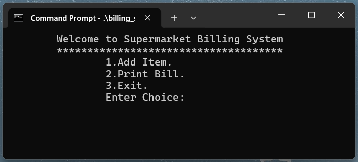
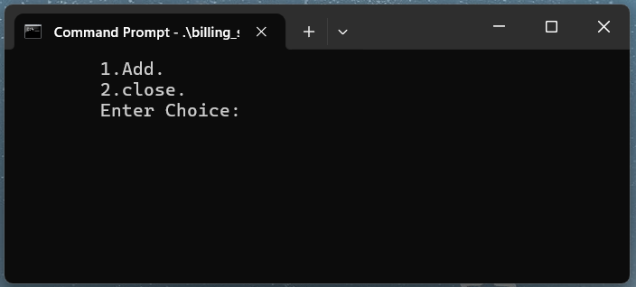
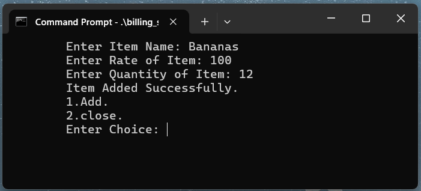
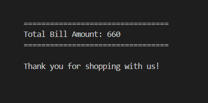

# 🛒 Supermarket Billing Management System

A C++ console application that simulates a supermarket billing system. It allows users to add items, generate bills based on available stock, and maintains item records using file handling.

## 🚀 Features

-  Add new items with name, rate, and quantity
-  Generate customer bills from stored items
- Updates available quantity after each billing
- Uses file handling (`Bill.txt`) to store inventory data
- Simple menu-driven console UI

## 🛠 Requirements

- C++ compiler (e.g., g++)
- Visual Studio Code or any code editor

## 🛠️ Setup Instructions

### ✅ Steps to Run System Locally

1.  **Compile the program**  
    Open a terminal in the folder and run:
    `g++ BillingSystem.cpp -o billing_system.exe`
    
2.  **Run the executable file**
    `.\billing_system.exe`

## 🖼️ Screenshots

#### 🔹 Main Menu

#### 🔹 Adding Items

#### 🔹 Total Bill

## 🌱 Future Improvements

-   Replace text file with a database like SQLite
    
-   Add user authentication
    
-   GUI version using Qt or another framework
    
-   Add support for categories, discounts, and ta